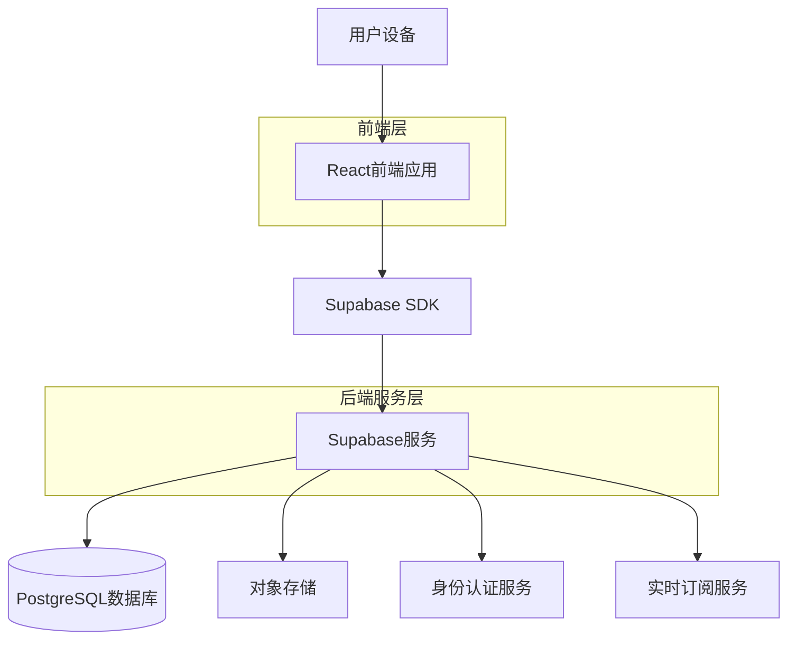
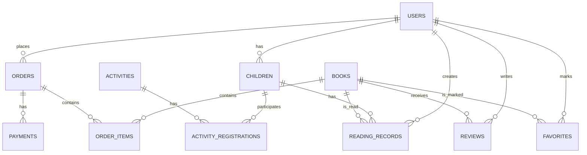

# 绘本岛平台技术架构文档

## 1. 架构设计



## 2. 技术描述

**前端技术栈：**

* React\@18 + TypeScript\@5

* Vite\@5（构建工具）

* Ant Design Mobile\@5（移动端UI组件库）

* React Router\@6（路由管理）

* Zustand\@4（轻量级状态管理）

* React Query\@5（数据获取和缓存）

**后端服务：**

* Supabase（BaaS平台，提供数据库、认证、存储等服务）

* 无需自建后端服务器，通过Supabase SDK直接调用

**部署方案：**

* Vercel（前端部署）

* Supabase（后端服务托管）

## 3. 路由定义

| 路由              | 页面名称 | 功能描述            |
| --------------- | ---- | --------------- |
| /               | 首页   | 展示轮播图、热门绘本、活动推荐 |
| /login          | 登录页  | 手机号、微信、一键登录     |
| /register       | 注册页  | 新用户注册，完善孩子信息    |
| /books          | 绘本馆  | 绘本分类展示和搜索       |
| /books/:id      | 绘本详情 | 展示绘本详细信息和评论     |
| /activities     | 亲子活动 | 线下活动展示和报名       |
| /activities/:id | 活动详情 | 活动详细介绍和报名       |
| /reading        | 阅读记录 | 阅读足迹和打卡记录       |
| /profile        | 用户中心 | 个人信息和订单管理       |
| /shopping-cart  | 购物车  | 商品管理和结算         |
| /orders         | 订单管理 | 订单列表和详情         |
| /address        | 地址管理 | 收货地址管理          |

## 4. 数据模型

### 4.1 核心数据表设计



### 4.2 数据库表结构定义

**用户表 (users)**

```sql
CREATE TABLE users (
    id UUID PRIMARY KEY DEFAULT gen_random_uuid(),
    phone VARCHAR(20) UNIQUE,
    email VARCHAR(255) UNIQUE,
    wechat_openid VARCHAR(100) UNIQUE,
    nickname VARCHAR(100),
    avatar_url TEXT,
    gender VARCHAR(10) CHECK (gender IN ('male', 'female', 'other')),
    birthday DATE,
    province VARCHAR(50),
    city VARCHAR(50),
    district VARCHAR(50),
    address_detail TEXT,
    is_verified BOOLEAN DEFAULT FALSE,
    membership_level VARCHAR(20) DEFAULT 'bronze' CHECK (membership_level IN ('bronze', 'silver', 'gold', 'platinum')),
    total_spent DECIMAL(10,2) DEFAULT 0,
    created_at TIMESTAMP WITH TIME ZONE DEFAULT NOW(),
    updated_at TIMESTAMP WITH TIME ZONE DEFAULT NOW()
);

CREATE INDEX idx_users_phone ON users(phone);
CREATE INDEX idx_users_wechat ON users(wechat_openid);
```

**孩子档案表 (children)**

```sql
CREATE TABLE children (
    id UUID PRIMARY KEY DEFAULT gen_random_uuid(),
    user_id UUID REFERENCES users(id) ON DELETE CASCADE,
    name VARCHAR(100) NOT NULL,
    gender VARCHAR(10) CHECK (gender IN ('male', 'female')),
    birth_date DATE NOT NULL,
    avatar_url TEXT,
    interests TEXT[], -- 兴趣标签数组
    reading_level INTEGER DEFAULT 1 CHECK (reading_level BETWEEN 1 AND 5),
    favorite_genres TEXT[],
    notes TEXT,
    is_active BOOLEAN DEFAULT TRUE,
    created_at TIMESTAMP WITH TIME ZONE DEFAULT NOW(),
    updated_at TIMESTAMP WITH TIME ZONE DEFAULT NOW()
);

CREATE INDEX idx_children_user_id ON children(user_id);
```

**绘本表 (books)**

```sql
CREATE TABLE books (
    id UUID PRIMARY KEY DEFAULT gen_random_uuid(),
    title VARCHAR(255) NOT NULL,
    author VARCHAR(255) NOT NULL,
    illustrator VARCHAR(255),
    translator VARCHAR(255),
    publisher VARCHAR(255),
    publish_date DATE,
    isbn VARCHAR(20) UNIQUE,
    description TEXT,
    cover_image TEXT NOT NULL,
    preview_images TEXT[], -- 预览图片数组
    age_range_min INTEGER CHECK (age_range_min >= 0),
    age_range_max INTEGER CHECK (age_range_max <= 18),
    pages INTEGER,
    price DECIMAL(10,2) NOT NULL,
    stock_quantity INTEGER DEFAULT 0,
    category VARCHAR(100),
    subcategory VARCHAR(100),
    tags TEXT[],
    language VARCHAR(50) DEFAULT '中文',
    binding_type VARCHAR(50) CHECK (binding_type IN ('hardcover', 'paperback', 'board_book', 'pop_up')),
    weight DECIMAL(8,2),
    dimensions VARCHAR(100), -- 尺寸，如"210x280x15mm"
    rating DECIMAL(3,2) DEFAULT 0,
    review_count INTEGER DEFAULT 0,
    sales_count INTEGER DEFAULT 0,
    is_featured BOOLEAN DEFAULT FALSE,
    is_active BOOLEAN DEFAULT TRUE,
    created_at TIMESTAMP WITH TIME ZONE DEFAULT NOW(),
    updated_at TIMESTAMP WITH TIME ZONE DEFAULT NOW()
);

CREATE INDEX idx_books_category ON books(category);
CREATE INDEX idx_books_age_range ON books(age_range_min, age_range_max);
CREATE INDEX idx_books_rating ON books(rating DESC);
CREATE INDEX idx_books_featured ON books(is_featured) WHERE is_featured = TRUE;
```

**亲子活动表 (activities)**

```sql
CREATE TABLE activities (
    id UUID PRIMARY KEY DEFAULT gen_random_uuid(),
    title VARCHAR(255) NOT NULL,
    description TEXT NOT NULL,
    activity_type VARCHAR(50) CHECK (activity_type IN ('story_telling', 'craft', 'outdoor', 'drama', 'reading_club')),
    organizer VARCHAR(255) NOT NULL,
    venue_name VARCHAR(255),
    address TEXT NOT NULL,
    province VARCHAR(50),
    city VARCHAR(50),
    district VARCHAR(50),
    longitude DECIMAL(10,7),
    latitude DECIMAL(10,7),
    start_time TIMESTAMP WITH TIME ZONE NOT NULL,
    end_time TIMESTAMP WITH TIME ZONE NOT NULL,
    age_range_min INTEGER,
    age_range_max INTEGER,
    max_participants INTEGER NOT NULL,
    current_participants INTEGER DEFAULT 0,
    price DECIMAL(10,2) NOT NULL,
    original_price DECIMAL(10,2),
    cover_image TEXT,
    detail_images TEXT[],
    requirements TEXT,
    what_to_bring TEXT,
    cancellation_policy TEXT,
    rating DECIMAL(3,2) DEFAULT 0,
    review_count INTEGER DEFAULT 0,
    is_featured BOOLEAN DEFAULT FALSE,
    is_published BOOLEAN DEFAULT TRUE,
    created_at TIMESTAMP WITH TIME ZONE DEFAULT NOW(),
    updated_at TIMESTAMP WITH TIME ZONE DEFAULT NOW()
);

CREATE INDEX idx_activities_type ON books(activity_type);
CREATE INDEX idx_activities_location ON activities(province, city, district);
CREATE INDEX idx_activities_time ON activities(start_time);
```

**阅读记录表 (reading\_records)**

```sql
CREATE TABLE reading_records (
    id UUID PRIMARY KEY DEFAULT gen_random_uuid(),
    user_id UUID REFERENCES users(id) ON DELETE CASCADE,
    child_id UUID REFERENCES children(id) ON DELETE CASCADE,
    book_id UUID REFERENCES books(id) ON DELETE CASCADE,
    reading_date DATE NOT NULL,
    reading_duration INTEGER, -- 阅读时长（分钟）
    rating INTEGER CHECK (rating BETWEEN 1 AND 5),
    notes TEXT,
    photos TEXT[], -- 阅读照片数组
    is_finished BOOLEAN DEFAULT FALSE,
    finished_at TIMESTAMP WITH TIME ZONE,
    created_at TIMESTAMP WITH TIME ZONE DEFAULT NOW(),
    updated_at TIMESTAMP WITH TIME ZONE DEFAULT NOW()
);

CREATE INDEX idx_reading_records_user_id ON reading_records(user_id);
CREATE INDEX idx_reading_records_child_id ON reading_records(child_id);
CREATE INDEX idx_reading_records_book_id ON reading_records(book_id);
CREATE INDEX idx_reading_records_date ON reading_records(reading_date);
```

**订单表 (orders)**

```sql
CREATE TABLE orders (
    id UUID PRIMARY KEY DEFAULT gen_random_uuid(),
    order_number VARCHAR(50) UNIQUE NOT NULL,
    user_id UUID REFERENCES users(id) ON DELETE CASCADE,
    order_type VARCHAR(50) CHECK (order_type IN ('book', 'activity', 'combo')),
    status VARCHAR(50) CHECK (status IN ('pending', 'paid', 'shipped', 'delivered', 'cancelled', 'refunded')),
    total_amount DECIMAL(10,2) NOT NULL,
    discount_amount DECIMAL(10,2) DEFAULT 0,
    final_amount DECIMAL(10,2) NOT NULL,
    currency VARCHAR(10) DEFAULT 'CNY',
    payment_method VARCHAR(50),
    payment_status VARCHAR(50) DEFAULT 'unpaid',
    paid_at TIMESTAMP WITH TIME ZONE,
    shipping_address JSONB,
    shipping_fee DECIMAL(10,2) DEFAULT 0,
    tracking_number VARCHAR(100),
    logistics_company VARCHAR(100),
    notes TEXT,
    cancelled_at TIMESTAMP WITH TIME ZONE,
    cancellation_reason TEXT,
    created_at TIMESTAMP WITH TIME ZONE DEFAULT NOW(),
    updated_at TIMESTAMP WITH TIME ZONE DEFAULT NOW()
);

CREATE INDEX idx_orders_user_id ON orders(user_id);
CREATE INDEX idx_orders_status ON orders(status);
CREATE INDEX idx_orders_created_at ON orders(created_at DESC);
```

## 5. 权限配置

### 5.1 Supabase RLS (Row Level Security) 策略

**基本权限设置：**

```sql
-- 为匿名用户授予基本读取权限
GRANT SELECT ON books TO anon;
GRANT SELECT ON activities TO anon;
GRANT SELECT ON reviews TO anon;

-- 为认证用户授予完整权限
GRANT ALL PRIVILEGES ON ALL TABLES IN SCHEMA public TO authenticated;
GRANT ALL PRIVILEGES ON ALL SEQUENCES IN SCHEMA public TO authenticated;
```

**RLS策略示例：**

```sql
-- 用户只能查看和修改自己的个人信息
ALTER TABLE users ENABLE ROW LEVEL SECURITY;
CREATE POLICY "Users can view own profile" ON users FOR SELECT USING (auth.uid() = id);
CREATE POLICY "Users can update own profile" ON users FOR UPDATE USING (auth.uid() = id);

-- 用户只能查看和修改自己孩子的信息
ALTER TABLE children ENABLE ROW LEVEL SECURITY;
CREATE POLICY "Users can manage own children" ON children FOR ALL USING (user_id = auth.uid());

-- 用户只能查看和修改自己的订单
ALTER TABLE orders ENABLE ROW LEVEL SECURITY;
CREATE POLICY "Users can view own orders" ON orders FOR SELECT USING (user_id = auth.uid());
CREATE POLICY "Users can create own orders" ON orders FOR INSERT WITH CHECK (user_id = auth.uid());
```

## 6. 性能优化策略

### 6.1 数据库优化

* **索引优化**：为常用查询字段建立复合索引

* **查询优化**：使用EXPLAIN分析查询计划，避免全表扫描

* **数据分区**：按时间分区存储历史数据

* **缓存策略**：使用Redis缓存热点数据

### 6.2 前端优化

* **代码分割**：按路由和组件懒加载

* **图片优化**：使用WebP格式，支持响应式图片

* **CDN加速**：静态资源使用CDN分发

* **预加载策略**：关键资源预加载，提升用户体验

### 6.3 API优化

* **分页加载**：大数据列表使用分页加载

* **数据聚合**：减少API请求次数，一次获取必要数据

* **实时更新**：使用Supabase实时订阅，减少轮询

* **错误处理**：完善的错误处理和重试机制

## 7. 安全考虑

### 7.1 数据安全

* **数据加密**：敏感数据加密存储

* **访问控制**：严格的权限控制和审计日志

* **数据备份**：定期数据备份和灾难恢复

* **隐私保护**：符合GDPR和相关隐私法规

### 7.2 应用安全

* **输入验证**：严格的输入验证和SQL注入防护

* **XSS防护**：防止跨站脚本攻击

* **CSRF防护**：防止跨站请求伪造

* **HTTPS**：全站HTTPS加密传输

## 8. 监控和分析

### 8.1 应用监控

* **性能监控**：监控页面加载时间和API响应时间

* **错误监控**：实时错误收集和报警

* **用户行为分析**：用户行为路径和转化率分析

* **业务指标**：关键业务指标的实时监控

### 8.2 数据分析

* **用户画像**：基于行为数据的用户画像构建

* **推荐算法**：基于协同过滤和内容过滤的推荐

* **A/B测试**：支持功能迭代的A/B测试

* **数据可视化**：业务数据的可视化展示

